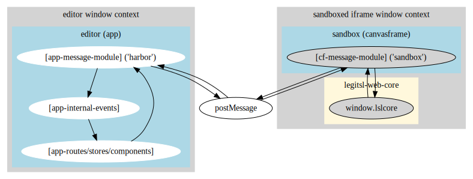

# lsl editor

A client-side web-based editor for [LegitSL/LegitScript](https://github.com/Raikiri/LegitScript). Uses a [stripped-down fork](https://github.com/sam-Izdat/legitsl-web-core) of [LegitScriptEditor](https://github.com/radiance-cascades/LegitScriptEditor/) in a sandboxed iframe. The editor was built with [Sveltekit](https://svelte.dev/), [Skeleton UI toolkit](https://www.skeleton.dev/) and [Monaco Editor](https://microsoft.github.io/monaco-editor/).

## [You can find it here.](https://sam-izdat.github.io/lsl-editor)

It can be installed locally with a PWA-capable browser if you want to use it offline. You can also use the github-hosted version to share gists or RAW URLs, or embed them somewhere on the web as an iframe – see the "Import / Export" button on the sidebar for details.


# Building

To build static:

```bash
npm i
npm run build
```

To build dynamic (with server logic and routing):

```bash
npm run build:server
```

# Developing

To develop static:

```bash
npm run dev
```

To develop dynamic: 

```bash
npm run dev:server
```

You can (for convenience) develop with a local version of `legitsl-web-core` by cloning it to `../legitsl-web-core`. To watch it locally for changes and rebuild it automatically, you can use `npm run dev:watch` (or `npm run dev:server:watch`).

## Note on cache issues

The version number is used as a cache bust and should be bumped for every build, even for trivial changes, or the browser will 404 trying to fetch nonexistent resources from the canvas iframe. You can either commit your changes and use `npm version patch` or just increase the version manually.

## Why iframe isolation? 

While LegitSL offers a layer of protection from arbitrary code execution in the editor, because it does not directly run user-supplied JS, the sandboxed iframe guarantees and enforces it. An externally-linked script is treated as cross-domain and does not have privileged access to the editor's window context. It therefore cannot, even in principle, delete or modify saved data or (in the case of a server build) access the user session. This all but eliminates most of the risks of XSS should a vulnerability ever exist or should user-supplied JS execution ever be added in the future as an intentional editor feature.

## Why is legitsl-web-core separate? 

Because, for whatever reason, it does not seem to play nice with Sveltekit, and I don't want to launch a forensic investigation to figure out why. 

Here is roughly how everything connects:



At the moment, the "app" store called "context" is responsible for managing most of the script-defined UI, which is continuously rendered in the editor's DOM (but only updated as necessary).