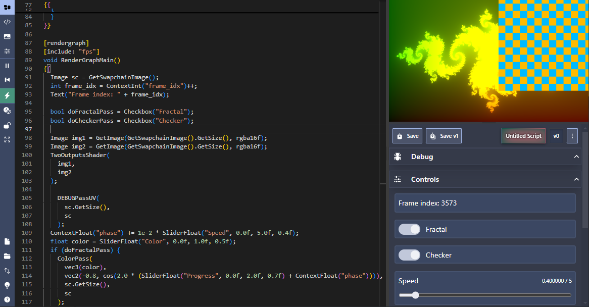

# lsl editor

An client-side web-based editor for [LegitSL/LegitScript](https://github.com/Raikiri/LegitScript). Uses a [stripped-down fork](https://github.com/sam-Izdat/legitsl-web-core) of [LegitScriptEditor](https://github.com/radiance-cascades/LegitScriptEditor/) in a sandboxed iframe. The editor was built with [Sveltekit](https://svelte.dev/), [Skeleton UI toolkit](https://www.skeleton.dev/) and [Monaco Editor](https://microsoft.github.io/monaco-editor/).

## [You can find it here.](https://sam-izdat.github.io/lsl-editor)

It can be installed locally with a PWA-capable browser if you want to use it offline. You can also use the github-hosted version to share gists or RAW URLs, or embed them somewhere on the web as an iframe – see the "Import / Export" button on the sidebar for details.

